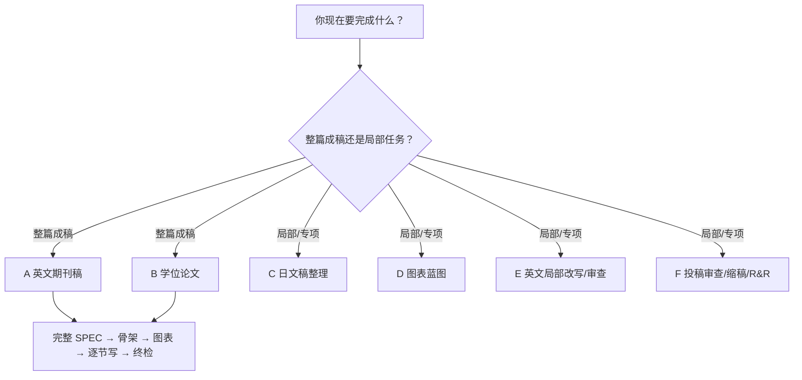

# Ohagi-Journal-Skill

> 面向经济学论文的成稿与投稿工作流：把**已经完成的研究**整理成英文期刊稿、学位论文，或直接处理日语、图表、英文局部改写与 R&R。

它不替作者发明研究。核心底线是：**不造数据、不造引用，主张强度不超过识别强度。**

## 30 秒选对路径

先判断你要的是整篇交付，还是只处理一个模块。

| 任务层级 | 快捷路径 | 是否需要完整 SPEC |
|---|---|---|
| **完整成稿主流程** | A. 英文期刊成稿；B. 学位论文正文 | 是。正式正文前必须补齐 |
| **局部/专项任务** | C. 日文稿整理；D. 图表蓝图；E. 英文局部改写/审查；F. 投稿、缩稿与 R&R | 否。使用轻量任务卡 |



图表蓝图既是 A/B 结果型论文内部的标准阶段，也可以单独调用；它是流程模块，不是与期刊稿、学位论文平级的交付目标。用户意图明确时，skill 会直接命中路径，不会为了分类增加一次询问。

## 它解决什么

- **证据边界**：缺数字用 `【作者补】`，缺引用用 `【待核】`；关联设计不偷写成因果。
- **方法感知**：按 `paper_type + method_family + primary estimand` 加载 RCT、DiD、IV、RDD、SCM/SDID、结构估计、描述/测量、bunching、shift-share、因果 ML 等方法卡。
- **分节写作**：覆盖标题、摘要、引言、模型、数据、结果、零结果、结论和附录。
- **图表先行**：先做 exhibit plan，再 write-to-exhibit；提供 Stata/Python 三线表与图形工具，并要求渲染后视觉自检。
- **目标刊适配**：可从目标刊真实论文萃取动态写作层；精确页数、匿名、复现包和 AI 披露只采信当前官方要求。
- **投稿收口**：引用核验、三视角深审、working-paper 缩稿、逐点 R&R/referee response。
- **中日文支持**：日文稿可走字形、术语、直译腔和投稿/修論文体专项流程。

## 直接开始

### A. 英文期刊完整成稿

```text
我有一篇经济学研究要写成英文期刊稿。研究问题是 [...]，目标期刊候选是 [...]，
已有数据/回归/图表包括 [...]。请走 journal-drafting 的 A 路径，先过最小启动闸，
不要直接写正文。
```

### B. 学位论文

```text
我要写学位论文正文。学校/研究科规程是 [...]，导师要求是 [...]，已有结果包括 [...]。
请走 B 路径，先检查材料状态和章结构，不要套用期刊专属要求。
```

### C–F. 局部/专项任务

```text
# C 日文整理
只整理下面的日文稿。目标是 [投稿刊/修論规程]；只改语言与文体，不动论证、数字和引用：[文本]

# D 图表蓝图
只做 exhibit plan。这里是结果清单 [...]；请决定头牌图表、叙事弧和主文/附录放置，不写正文。

# E 英文局部
只改写/审查下面这段 [abstract/results/conclusion]；保留原意，缺数字写【作者补】，缺引用写【待核】：[文本]

# F 投稿/R&R
逐点处理下面的审稿意见。作者已完成的真实修改是 [...]；没有的新分析、页码和表号一律标【作者补】：[意见]
```

更多可复制 prompt 和各路径输入要求见 [快速开始](docs/getting-started.md) 与 [路径选择](docs/entrypoints.md)。

## A/B 完整成稿如何运行

```text
最小启动闸
  → 完整 SPEC
  → 可选：文献宽度扩展 / 目标刊动态写作层
  → 章节骨架
  → 图表蓝图（结果型论文）
  → 逐节写作 + 单节自查
  → 总闸
  → 引用穷尽核验
  → 审稿人/答辩委员预演
```

完整 SPEC 会持久化目标约束、结构母本、contribution、`paper_type`、`method_family`、`primary estimand`、主要/辅助识别、推断风险、外部有效性、PAP/预注册以及数据访问与复现状态。

## 安装

先克隆仓库：

```bash
git clone https://github.com/Ohagi-AST/Ohagi-Journal-Skill.git
cd Ohagi-Journal-Skill
```

最低安装只需要原创编排器 `journal-drafting`。推荐同时安装两个随包 vendor skill，以启用引用核验和目标刊动态适配。

### macOS / Linux

```bash
mkdir -p ~/.claude/skills
cp -R skills/journal-drafting          ~/.claude/skills/
cp -R skills/vendor/reference-checker  ~/.claude/skills/
cp -R skills/vendor/journal-adapt      ~/.claude/skills/
```

### Windows PowerShell

```powershell
New-Item -ItemType Directory -Force "$HOME\.claude\skills" | Out-Null
Copy-Item -Recurse -Force skills\journal-drafting          "$HOME\.claude\skills\"
Copy-Item -Recurse -Force skills\vendor\reference-checker  "$HOME\.claude\skills\"
Copy-Item -Recurse -Force skills\vendor\journal-adapt      "$HOME\.claude\skills\"
```

Codex 或其他 agent：复制到其 skill 目录即可；若环境不支持 skill 文件夹，直接让 agent 读取 `skills/journal-drafting/SKILL.md`。`journal-adapt` 的 PDF→Markdown 可选功能需要 MinerU；已有 Markdown/文本语料时不需要。

## 项目结构

```text
skills/
├── journal-drafting/
│   ├── SKILL.md                    # 两层路由与交互编排
│   ├── template-master-framework.md # A/B 完整成稿母版
│   ├── references/                 # 分节、方法、实证、投稿、图表、日语规则
│   ├── scripts/                    # 图表渲染、映射与日文字形检查
│   └── agents/openai.yaml          # Codex UI 元数据
└── vendor/
    ├── reference-checker/          # 引用核验（MIT）
    └── journal-adapt/              # 目标刊动态写作层（MIT）

docs/                               # 用户文档
evals/                              # 语义评测 prompts + rubric
tests/                              # 工具链、链接一致性与语义守卫测试
```

## 规则如何加载

优先级固定为：

1. 不造数/引用与主张上限；
2. 目标刊当前官方要求；
3. 目标刊动态层与真实语料；
4. 论文类型与方法卡；
5. 通用分节和语言默认值。

主 `SKILL.md` 只保留路由和硬护栏，详细规则按任务从 `references/` 加载，避免一次把无关内容塞进上下文。

## 文档

| 文档 | 用途 |
|---|---|
| [路径选择](docs/entrypoints.md) | 两类需求、六条快捷路径、输入与升级条件 |
| [快速开始](docs/getting-started.md) | 可复制 prompt 与工作流卡片 |
| [体系概览](docs/overview.md) | 架构、组件和规则优先级 |
| [交互说明](docs/interaction-guide.md) | 完整流程硬闸与专项任务节奏 |
| [规则速查](docs/reference/rules-overview.md) | 母版规则 1–9 |
| [来源与致谢](skills/journal-drafting/credits-and-sources.md) | 采用内容、许可证和一手来源锚点 |

## 验证

```bash
python -m pip install -r requirements-dev.txt
python -m unittest discover -s tests
python tests/smoke_test.py
```

测试覆盖脚本工具链、内部链接、术语一致性、六条快捷路由、完整 SPEC、安全护栏和语义评测结构。语义场景见 [`evals/test-cases.md`](evals/test-cases.md)。

## 第三方组件与许可证

- 原创部分 `skills/journal-drafting/`：MIT，见根 [LICENSE](LICENSE)。
- `skills/vendor/reference-checker/`：Liuxiangjian-ai/reference-checker-skill，MIT。
- `skills/vendor/journal-adapt/`：WantongC/journal-adapt-writing-skill，MIT；本仓库保留上游署名与修改说明。
- 写作规则还借鉴了 [hanlulong/econ-writing-skill](https://github.com/hanlulong/econ-writing-skill)、[lishn6/awesome-ai-econ-research-writing](https://github.com/lishn6/awesome-ai-econ-research-writing)、[Lambenthan/empiricalwiki](https://github.com/Lambenthan/empiricalwiki) 等项目；具体采用边界见[来源与致谢](skills/journal-drafting/credits-and-sources.md)。

使用和再分发时请保留相应署名。
